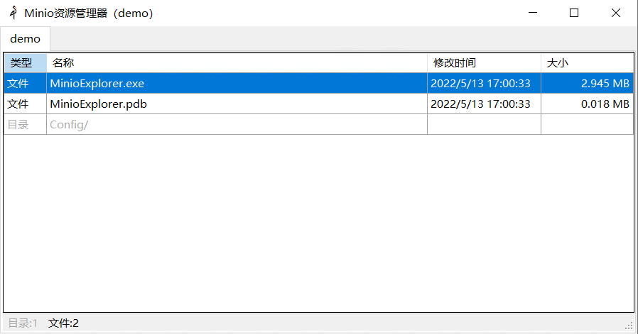

# Minio文件管理器

## 程序截图




## 程序说明

### 作用

- 用来分发文件
- 通过配置文件设置用户可访问的Bucket（免登录，打开就能用）

### 配置

- 启动程序时如果没有配置则会生成一个配置模板`./Config/demo.json`
- 配置文件放在`./Config/`目录中，必须是`.json`文件，文件名作为界面中的Tab标题。配置项如下：

``` json
{
    "Endpoint": "localhost:9000",                         # Minio服务地址
    "AccessKey": "nMWWoVtyobkwQGKf",					# Bucket访问AccessKey
    "SecretKey": "cs6z2f8QvXitxXnuzK4z5Fw0iB5cPn6U",	 # Bucket访问SecretKey
    "Bucket": "demo"								   # Bucket
}
```

### 使用

- Tab页切换不同Bucket配置
- 拖动文件或目录到程序中上传（可以同时上传多个文件和目录）
- 文件双击下载
- 文件夹双击进入
- 文件文件夹右键下载